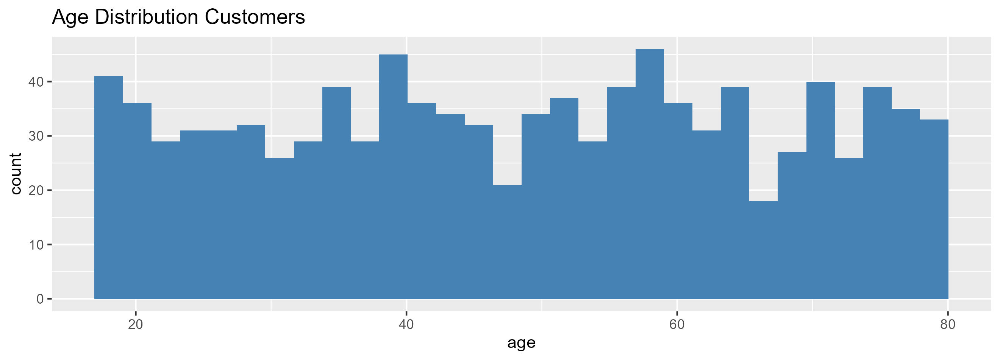
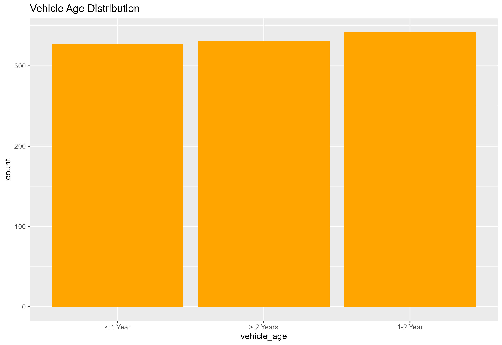
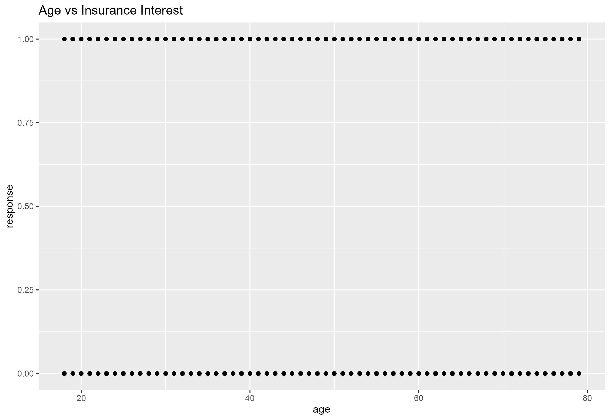

# Insight Report

## 1. Data Overview 
Source: `load_data.R`
-  The dataset contains 1,000 customers, which is a sufficient sample size for behavior analysis.
-  The data structure is clean and includes a mix of numerical and catogorical variables such as age, gender, vehicle age, vehicle damage, and insurance response

## 2. Customer Demographics
Source: `eda_summary.R`
-  Customers fall mainly within the working-age group, relevant to vehicle insurance.
- Gender distribution is balanced, avoiding segmentation bias.

## 3. Vehicle Profile
Source: `eda_summary.R`
- Vehicle age is evenly distributed across categories -> dataset is well-balanced.
- Vehicle damage is nearly equal distribution -> idea for comparing interest rate by risk profile.

## 4. Insurance Engagement (Response Behavior)
Source: `eda_summary.R`
    - Not interested (0): 504
    - Interested (1): 496
    - Interest rate = 49.6%
- Customer interest is almost evenly split -> strong potential for targeted marketing.

## 5. Early Predictors (From Basic Summary)
Source: `eda_insights.R`
- Grouped analysis in this file indicates customers with prior vehicle damage show higher insurance interest.
-> This aligns with industry behavior: customers with prior risks tend to have higher demand for insurance coverage.

## 6. Visualization-Based Insights
Source: `eda_visualization.R`

- Age distribution histogram

age_historgram.jpg shows a large cluster in ages 30–60 → high-value demographic.

- Vehicle age bar plot
 

Even distribution across vehicle age groups → segmentation possible without bias.

- Response vs Age scatterplot

No strong linear pattern → age is not the primary driver of purchase interest.

## 7. Summary of key findings
- The dataset is balanced across major categorical variables -> reliable for analysis.

- Interest rate (49.6%) indicates strong market potential.

- Vehicle damage emerges as a strong predictor of interest.

- Customer base is diverse in age, with the majority concentrated in 30 - 60.

- No skewness in categorical variables -> great for modeling and segmentation.